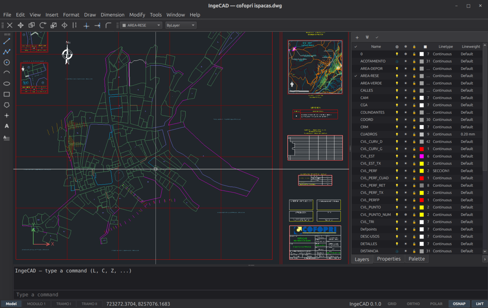

# IngeCAD

**[ingecad.org](https://ingecad.org)** · CAD 2D libre para Linux, con DWG de fábrica.

**Free 2D CAD for Linux, in the spirit of classic AutoCAD.**

IngeCAD is a lightweight 2D drafting program for civil engineers and architects
migrating from AutoCAD: same command aliases (`M` ⏎ moves, `TR` ⏎ trims), the
classic pre-ribbon interface (menus + toolbars + a real command line), and
faithful round-tripping of the DWG/DXF files your colleagues send you.

Part of the **Inge** ecosystem, alongside
[IngeTrazo](https://github.com/ingelibre/ingetrazo) (free 3D modeling / BIM)
and IngePresupuestos (construction budgeting).



> *A real cadastral DWG open in IngeCAD 0.1 on Linux — layers panel, classic
> command line, Model/Layout tabs, and status-bar toggles.*

## Design pillars

- **Faithful files first.** The document model *is* the DXF database (via
  [ezdxf](https://ezdxf.mozman.at/)); everything IngeCAD does not understand is
  preserved untouched when saving. DWG is handled by external converters
  (GNU LibreDWG bundled; ODA File Converter optional) — never parsed in-app.
- **AutoCAD muscle memory.** Command line at the bottom, `acad.pgp`-compatible
  aliases, window/crossing selection, object snaps with the classic markers.
- **Linux/Wayland first.** Native, fast, no ribbon — ever.
- **Deliberately small.** Lines, circles, polylines, blocks, layers, hatches,
  trim/offset/extend, survey points with elevations, and printing to scale.
  Not a feature-for-feature AutoCAD clone.

## Status — v0.3

What works today:

- **Faithful viewer** for real-world DWG/DXF: nested blocks, MTEXT, hatches
  (patterns + solids), linetypes, dimensions, OCS, paperspace layouts —
  smooth pan/zoom even on cadastre-scale drawings (90k+ entities).
- **DWG in and out**: open `.dwg` transparently via GNU LibreDWG; save as
  DWG r2000 (LibreDWG) or r2018 (ODA File Converter, if installed), with a
  silent verified-save check.
- **Classic interface**: command line at the bottom with AutoCAD aliases
  (`L`, `C`, `M`, `TR`, `Z`+`E` …), dark model space, dockable Layers /
  Properties / Styles panels.
- **Paper space like AutoCAD**: Model/Layout tabs, MVIEW floating viewports
  with grips, exact scales via `ZOOM nXP` or the scale dropdown, MSPACE /
  PSPACE, viewport lock, PAGESETUP per layout, and PLOT of the sheet at 1:1.
- **Drawing with the real prompt trees**: lines, circles (2P/3P/TTR), the
  full 11-way ARC matrix, polylines with arcs and width, rectangles
  (chamfer/fillet/area/rotation), polygons, ellipses and elliptical arcs,
  text with all 14 justifications, hatches; construction lines (XLINE/RAY),
  DIVIDE/MEASURE with aligned blocks, REVCLOUD.
- **Dimensions, complete**: linear, aligned, angular, arc length, ordinate,
  radius, diameter, center marks, continue/baseline chains and DIMTEDIT —
  every command with AutoCAD's own options (`Text` with `<>`, `Angle`,
  `Rotated`, `Quadrant`, `Partial`…) and the official prompts, plus the
  **Dimension Style Manager** with its five tabs and a live preview.
- **Layers like AutoCAD's**: the properties table (status, on, freeze, lock,
  colour, linetype, lineweight, plot, description) with live search, and the
  `-LAYER` command line with wildcards for the keyboard-only flow.
- **Editing**: ERASE / MOVE / COPY / ROTATE / SCALE / MIRROR / OFFSET
  (polylines and arcs included, distance by mouse) / TRIM / EXTEND / FILLET /
  CHAMFER / STRETCH / BREAK / JOIN / ARRAY / MATCHPROP / PEDIT / EXPLODE,
  grips, window/crossing selection, clipboard copy/paste, and ROTATE/SCALE
  show the result turning live under the cursor.
- **The MTEXT in-place editor**: text edits on the canvas at its real size
  with the classic Text Formatting toolbar (style, font, height, bold,
  italic, underline, overline, colour), the ruler with indents, tab stops
  and the width arrow, line spacing, bullets and numbered lists, background
  mask and static columns — all stored as AutoCAD's own inline codes.
- **The AutoCAD feel**: object snaps with AutoSnap markers (END, MID, CEN,
  NOD, INT, PER, TAN, QUA, INS, GCE — on curves too) with the status-bar
  running-snap list, ORTHO / POLAR, absolute / relative / polar coordinate
  input, command prefix autocomplete (`OFF` runs OFFSET), inquiry commands
  (DIST / ID / AREA / LIST), UNITS, blocks (`B` / `I`), a startup window
  with template units and recent drawings with thumbnails, and undo/redo of
  everything.
- **Output**: print / export PDF and PNG to exact scale, from model or
  layout.
- **Raster images and PDF underlays**: attach PNG/JPEG/BMP/GIF/TIFF or a
  PDF page (rasterized) to trace over, with corner grips, brightness /
  contrast / fade and a transparency degree.
- **Tables** (plain-geometry grids), **splines**, **revision clouds**,
  **DRAWORDER** and the layer tools (LAYISO/LAYOFF/LAYON/LAYUNISO).
- **Grips on every selectable type**, dimensions included: drag an
  extension origin to re-measure, the line to relocate, the text to move
  the label — with alignment snapping to neighbouring dimensions.

Planned next (v0.4): survey-point import with elevations, coordinate
tables, elevation profiles. See `CLAUDE.md` for the roadmap.

## Install (Linux, x86_64)

Download the AppImage from the
[latest release](https://github.com/ingelibre/ingecad/releases/latest), make it
executable, run it. Nothing else to install — Python, Qt and the DWG converters
are inside:

```bash
chmod +x IngeCAD-*-x86_64.AppImage
./IngeCAD-*-x86_64.AppImage            # or double-click it
./IngeCAD-*-x86_64.AppImage --check    # if something misbehaves
```

If your distro lacks FUSE (the one thing an AppImage needs), each release
also ships the same build as a plain tarball — extract and run:

```bash
tar -xzf IngeCAD-*-linux-x86_64.tar.gz
IngeCAD-*/ingecad
```

`--check` prints where the app found its shaders, translations and converters,
and exits non-zero if any of them is missing.

## Running from source

```bash
git clone https://github.com/ingelibre/ingecad.git
cd ingecad
python3 -m venv venv
venv/bin/pip install -r requirements.txt
venv/bin/python main.py
```

**DWG support** needs the LibreDWG converters (`dwg2dxf` / `dxf2dwg`). The
release AppImage carries them already; from a source checkout, either put them
on your `PATH` (most distros package `libredwg-tools`) or build the patched ones
IngeCAD ships:

```bash
tools/libredwg-patches/build-vendor.sh    # downloads, patches, builds into vendor/
```

That build is not stock: it is LibreDWG 0.14.8556 plus thirteen fixes, all of
them open as pull requests upstream, without which several real-world drawings
do not open at all. See `tools/libredwg-patches/README.md`. DXF works out of the
box either way, and installing the freeware ODA File Converter additionally
enables DWG r2018 export.

## Building the AppImage yourself

```bash
tools/libredwg-patches/build-vendor.sh   # once, for the converters
packaging/build-appimage.sh              # -> dist/IngeCAD-<version>-x86_64.AppImage
```

An AppImage links against the glibc of the machine that built it, so one built
on a current distro will not start on an older one. The release workflow
(`.github/workflows/release.yml`) builds on Ubuntu 22.04 for that reason.

To get the launcher entry, app icon and `.dwg`/`.dxf` double-click
association on Linux:

```bash
./scripts/install-desktop.sh   # then log out/in once
```

## License

GPL-3.0-or-later. Copyright (C) 2026 Marco Sumari Tellez and IngeCAD
contributors. See `LICENSE` and `AUTHORS`.
